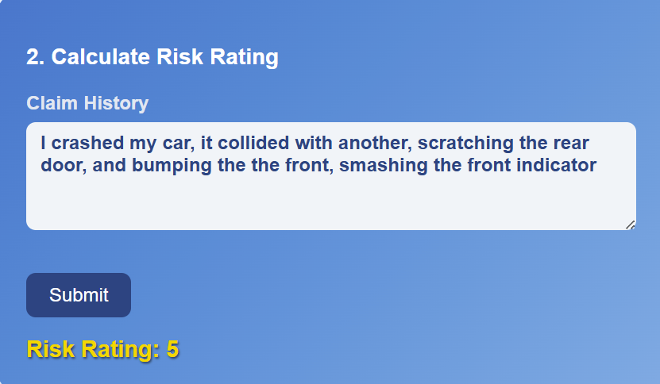
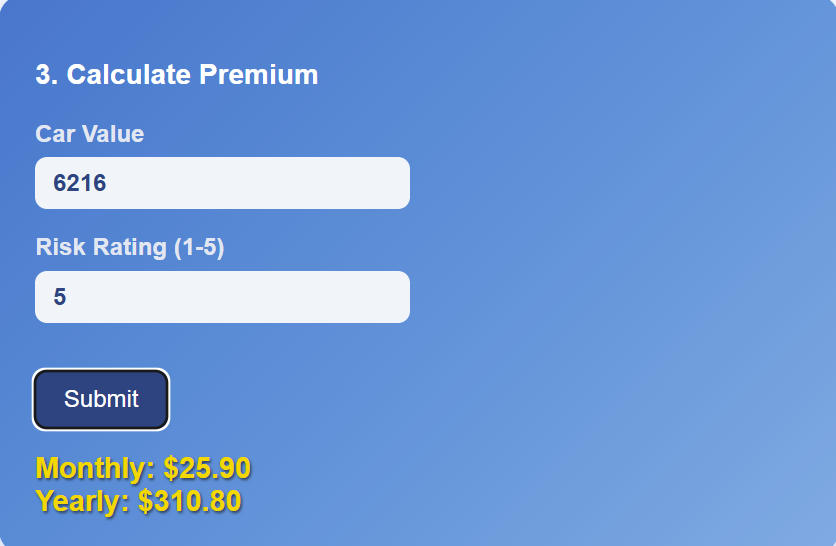

<!-- Improved compatibility of back to top link: See: https://github.com/othneildrew/Best-README-Template/pull/73 -->

<a id="readme-top"></a>

<!-- PROJECT SHIELDS -->

[![Contributors][contributors-shield]][contributors-url]
[![Forks][forks-shield]][forks-url]
[![Stargazers][stars-shield]][stars-url]
[![Issues][issues-shield]][issues-url]
[![Unlicense License][license-shield]][license-url]
[![LinkedIn][linkedin-shield]][linkedin-url]

<!-- PROJECT LOGO -->

<br />
<div align="center">
  <h3 align="center">🚗 Turners Car Insurance Project(TDD) – Mission 2 (May 2025)</h3>

  <p align="center">
    Insurance calculator that can calculate Car Value, Risk Rating, and Quote.
    <br />
    <a href="https://github.com/benthuralot/mission2-may-2025"><strong>Explore the code »</strong></a>
    <br />
    <a href="#installation">Install Guide</a>
    ·
    <a href="#usage">Usage</a>
  </p>
</div>

---

## Table of Contents

- [About The Project](#about-the-project)
- [Folder Structure](#folder-structure)
- [Built With](#built-with)
- [Getting Started](#getting-started)
  - [Prerequisites](#prerequisites)
  - [Installation](#installation)
- [Usage](#usage)
- [Contributing](#contributing)
- [Contact](#contact)

---

## About The Project

This is full-stack Insurance Calculating web app themed after Tuners Cars. It allows users to calculate the value of the car, the severity of the damages, and calculates the monthly and yearly premium.
---

## 📁 Folder Structure

```bash
mission2-may-2025/
   ── Backend/
      ├── config/
      ├── node_modules/
      ├── tests/
      │   ├── server.test.js
      │   └── services.premiumCalculator.test.js
      ├── .gitignore
      ├── apiRoutes.js
      ├── apiRoutes.test.js
      ├── babel.config.cjs
      ├── caculateRiskRating.js
      ├── caculateRiskRating.test.js
      ├── calculateCarValue_TEST_CASES.md
      ├── calculateCarValue.js
      ├── calculateCarValue.test.js
      ├── jest.config.mjs
      ├── package-lock.json
      ├── package.json
      ├── premiumCalculator.js
      ├── server.js
      └── server.test.js

    ──  Frontend
        ├ src/
        ├─── assets/
        ├─── components/
        │   ├─── Footer.jsx
        │   ├─── Header.jsx
        │   ├─── InputCard.css
        │   └─── InputCard.jsx
        ├─── App.css
        ├─── App.jsx
        ├─── index.css
        └─── main.jsx
```

---

## Built With

- 
  
- 
  
- 
- 

---

## Getting Started

### Prerequisites

- Node.js & npm
- Google Cloud project with Vision & AutoML APIs enabled
- A trained AutoML model (if using custom)

### Installation

1. Clone the repo

```bash
git clone https://github.com/benthuralot/mission2-may-2025.git
cd mission2-may-2025
```

2. Install dependencies

```bash
# From project root
cd backend
npm install

cd ../frontend
npm install
```

3. Start locally:

```bash
# Open a terminal to run frontend
cd frontend
npm run dev

# Open a seperate terminal to run backend
cd backend
nodemon index.js
```
---
### Tester
```bash
# Open the terminal to run test file
cd backend
npm test
```
---

## Usage

* Input field 1: Input the model of the car and thee year it was made and click submit. It will calculate the value of your car.<br/><br/>
  <br/><br/>
* Input Field 2: Input the information of what happened during the crash and press submit. It will calculate the severity of the car crash.<br/><br/>
  <br/><br/>
* Input Field 3: Input the value of the car and the risk rating, press submit to find out the cost of the premium. <br/><br/>
  <br/><br/>

---

## Contributing

1. Fork the Project
2. Create your Feature Branch (`git checkout -b feature/AmazingFeature`)
3. Commit your Changes (`git commit -m 'Add some AmazingFeature'`)
4. Push to the Branch (`git push origin feature/AmazingFeature`)
5. Open a Pull Request

---

## Contributors

  <a href="https://github.com/benthuralot/mission2-may-2025/graphs/contributors">

</a>
 
</div>

---

## Contact

**Project Lead:** Hershyl<br>
**GitHub:** [benthuralot](https://github.com/benthuralot)

**Project Developer:** Erekle Sesiashvili<br>
📧 [erekles@missionreadyhq.com](mailto:erekles@missionreadyhq.com)<br>
[GitHub Profile] https://github.com/smesi36<br>

**Project Developer:** Tutanekai Manuera<br>
📧 [tutanekaim@missionreadyhq.com](mailto:tutanekaim@missionreadyhq.com)<br>
[GitHub Profile] https://github.com/FootNuggets22<br>

Project Repo: [https://github.com/benthuralot/mission2-may-2025](https://github.com/benthuralot/mission2-may-2025)

---

<!-- MARKDOWN LINKS -->

[contributors-shield]: https://img.shields.io/github/contributors/benthuralot/mission2-may-2025.svg?style=for-the-badge
[contributors-url]: https://github.com/benthuralot/mission2-may-2025/graphs/contributors
[forks-shield]: https://img.shields.io/github/forks/benthuralot/mission2-may-2025.svg?style=for-the-badge
[forks-url]: https://github.com/benthuralot/mission2-may-2025/network/members
[stars-shield]: https://img.shields.io/github/stars/benthuralot/mission2-may-2025.svg?style=for-the-badge
[stars-url]: https://github.com/benthuralot/mission2-may-2025/stargazers
[issues-shield]: https://img.shields.io/github/issues/benthuralot/mission2-may-2025.svg?style=for-the-badge
[issues-url]: https://github.com/benthuralot/mission2-may-2025/issues
[license-shield]: https://img.shields.io/github/license/benthuralot/mission2-may-2025.svg?style=for-the-badge
[license-url]: https://github.com/benthuralot/mission2-may-2025/blob/main/LICENSE
[linkedin-shield]: https://img.shields.io/badge/-LinkedIn-black.svg?style=for-the-badge&logo=linkedin&colorB=555
[linkedin-url]: https://linkedin.com/in/yourlinkedin
